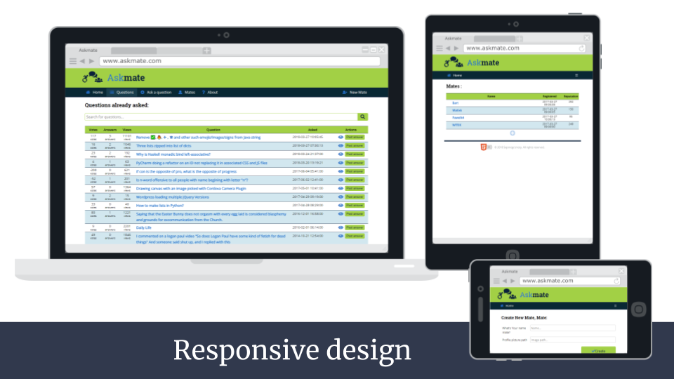

# AskMate

It's a simple user forum based on stackoverflow.

## Requirements

* Python 3.6
* PostgreSQL
* Psycopg2
* Flask

## Usage

Unzip this into folder and then open there terminal and run command:
```
cd sample_data
sudo -u postgres psql <YOUR_DB_NAME>
\q
cd ..
python server.py
```

## Screenshots

